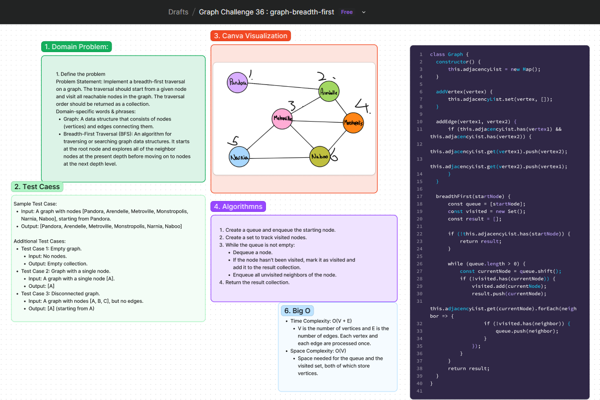

# Graph Breadth-First Traversal
Implement a breadth-first traversal on a graph. The traversal should start from a given node and visit all reachable nodes in the graph. The traversal order should be returned as a collection.

## Whiteboard Process
[Figma](https://www.figma.com/board/gDEFewf3Wnt3LIoqNLUqX0/Graph-Challenge-36-%3A-graph-breadth-first?node-id=14905-5&t=ux0IhxbYxp0le9ji-0) : 

## Approach
To perform a breadth-first traversal (BFS) on a graph, we use a queue to keep track of the nodes to be visited and a set to keep track of the visited nodes. Starting from the given node, we explore each node's neighbors level by level, ensuring that each node is visited only once. This approach ensures that we visit nodes in the order of their distance from the starting node.

### Steps:
1. Create a queue and enqueue the starting node.
2. Create a set to track visited nodes.
3. While the queue is not empty:
   - Dequeue a node.
   - If the node hasn't been visited, mark it as visited and add it to the result collection.
   - Enqueue all unvisited neighbors of the node.
4. Return the result collection.

### Big O Analysis
- **Time Complexity:** O(V + E)
  - V is the number of vertices and E is the number of edges. Each vertex and each edge are processed once.
- **Space Complexity:** O(V)
  - Space needed for the queue and the visited set, both of which store vertices.

## Solution
[Code link](./graph-breadth-first.js)

## Credit
ChatGPT help implemented the test file.
