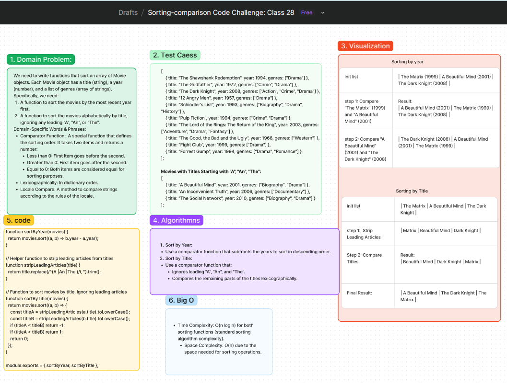

# Code Challenge: Sorting Movies

## Problem Statement
We need to write functions that sort an array of Movie objects. Each Movie object has a title (string), a year (number), and a list of genres (array of strings). Specifically, we need:
1. A function to sort the movies by the most recent year first.
2. A function to sort the movies alphabetically by title, ignoring any leading "A", "An", or "The".

## Whiteboard Process
[Figma](https://www.figma.com/board/RGlca8ooNU9F9kSiNFwScL/Sorting-comparison-Code-Challenge%3A-Class-28?node-id=0-1&t=pEyx9iu6r9PcCMfe-0) : 

## Approach
- **Sort by Year**: Use a comparator function that subtracts the years to sort in descending order.
- **Sort by Title**: Use a comparator function that:
  - Ignores leading "A", "An", and "The".
  - Compares the remaining parts of the titles lexicographically.

### Big O
- **Time Complexity**:
  - Sorting by year: O(n log n)
  - Sorting by title: O(n log n)
- **Space Complexity**: O(1)

## Solution
[Code link](./compare.js)

## Credit
ChatGPT assisted in implementing the test file.
