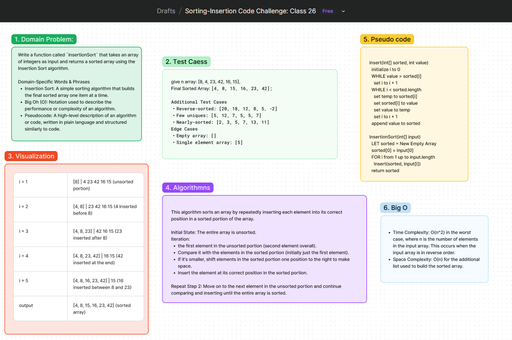

# Code Challenge: Class 26 - Insertion Sort

Write a function called `insertionSort` that takes an array of integers as input and returns a sorted array using the Insertion Sort algorithm. This algorithm sorts an array by repeatedly inserting each element into its correct position in a sorted portion of the array.

## Whiteboard Process

[Figma](https://www.figma.com/board/dhjfiXaX40nYuJ9gzbySyA/Sorting-Insertion-Code-Challenge%3A-Class-26?node-id=0-1&t=WWfyCEG5rzYHbLlp-0): 

## Approach

We will use the Insertion Sort algorithm, which builds the final sorted array one item at a time. The algorithm iterates over the input array and, for each element, inserts it into its correct position within a sorted portion of the array. This involves shifting elements in the sorted portion to make space for the new element.

### Detailed Steps:
1. Initialize the `sorted` array with the first element of the input array.
2. Iterate through the remaining elements of the input array.
3. For each element, use the `insert` function to place it in the correct position in the `sorted` array by:
   - Comparing the current element with elements in the `sorted` array.
   - Shifting elements in the `sorted` array as needed to make space for the current element.
4. Append the current element to its correct position.
5. Repeat the process until all elements are sorted.

### Big O

- **Time Complexity**: O(n^2) in the worst case, where `n` is the number of elements in the input array. This occurs when the input array is in reverse order.
- **Space Complexity**: O(n) for the additional list used to build the sorted array.

### Pseudocode
```
Insert(int[] sorted, int value)
  initialize i to 0
  WHILE value > sorted[i]
    set i to i + 1
  WHILE i < sorted.length
    set temp to sorted[i]
    set sorted[i] to value
    set value to temp
    set i to i + 1
  append value to sorted

InsertionSort(int[] input)
  LET sorted = New Empty Array
  sorted[0] = input[0]
  FOR i from 1 up to input.length
    Insert(sorted, input[i])
  return sorted
```

## Solution
[Code link](./sorting.js)

## Credit
Bard help implemented the test file
