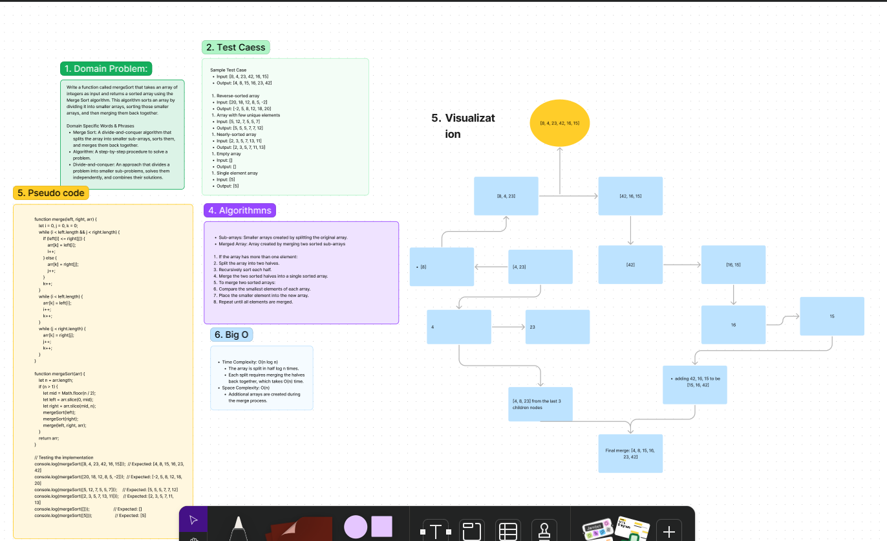

# Code Challenge: Class 27 - Merge Sort

Write a function called `mergeSort` that takes an array of integers as input and returns a sorted array using the Merge Sort algorithm. This algorithm sorts an array by dividing it into smaller arrays, sorting those smaller arrays, and then merging them back together.

## Whiteboard Process

[Figma](https://www.figma.com/board/r5RpEUDbNXpZk1AnIXhGWO/merge-sort-Code-Challenge%3A-Class-27?node-id=0-1&t=ELAb7to3nImjxeMK-0) : 

## Approach

We will use the Merge Sort algorithm, which is a divide-and-conquer algorithm. It works by recursively splitting the input array into two halves, sorting each half, and then merging the sorted halves back together.

### Big O

- **Time Complexity**: O(n log n), where `n` is the number of elements in the input array. This is because the array is repeatedly split in half (log n splits) and each split requires merging the halves back together (n comparisons in each merge).
- **Space Complexity**: O(n) for the additional arrays used during the merge process.

## Solution

### Pseudocode
```plaintext
ALGORITHM Mergesort(arr)
    DECLARE n <-- arr.length
    if n > 1
        DECLARE mid <-- n / 2
        DECLARE left <-- arr[0...mid]
        DECLARE right <-- arr[mid...n]
        // sort the left side
        Mergesort(left)
        // sort the right side
        Mergesort(right)
        // merge the sorted left and right sides together
        Merge(left, right, arr)

ALGORITHM Merge(left, right, arr)
    DECLARE i <-- 0
    DECLARE j <-- 0
    DECLARE k <-- 0
    while i < left.length && j < right.length
        if left[i] <= right[j]
            arr[k] <-- left[i]
            i <-- i + 1
        else
            arr[k] <-- right[j]
            j <-- j + 1
        k <-- k + 1
    if i = left.length
       set remaining entries in arr to remaining values in right
    else
       set remaining entries in arr to remaining values in left
```

## Solution
[Code link](./merge.js)

## Credit
ChatGPT assisted in implementing the test file.
xsx
