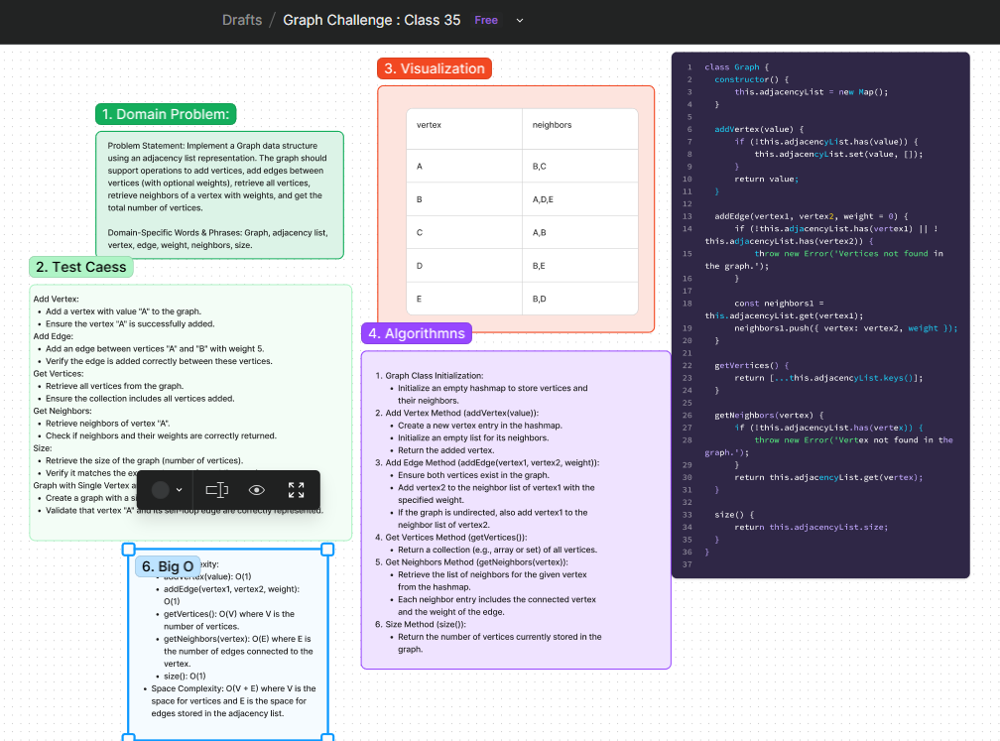

# Graph Implementation

## Problem Statement
Implement a Graph data structure using an adjacency list representation. The graph should support operations to add vertices, add edges between vertices (with optional weights), retrieve all vertices, retrieve neighbors of a vertex with weights, and get the total number of vertices.

## Whiteboard Process
[Figma](https://www.figma.com/board/z48Xubev5Bs9TDxaP7EgFO/Graph-Challenge-%3A-Class-35?node-id=14905-5&t=HCW7BUrZJeED2WRD-0) : 

### Features
1. **addVertex(value)**
   - Arguments: `value`
   - Returns: The added vertex
   - Description: Adds a vertex with the given value to the graph.

2. **addEdge(vertex1, vertex2, weight)**
   - Arguments: `vertex1`, `vertex2`, `weight` (optional)
   - Returns: Nothing
   - Description: Adds a new edge between `vertex1` and `vertex2` in the graph. Optionally assigns a weight to the edge.

3. **getVertices()**
   - Arguments: None
   - Returns: A collection (e.g., array or set) of all vertices in the graph.
   - Description: Retrieves all vertices currently stored in the graph.

4. **getNeighbors(vertex)**
   - Arguments: `vertex`
   - Returns: A collection of objects representing neighbors of the given `vertex`. Each object contains `vertex` and `weight`.
   - Description: Retrieves all neighbors of the specified `vertex` along with the weights of the connections.

5. **size()**
   - Arguments: None
   - Returns: The total number of vertices in the graph.
   - Description: Returns the count of vertices currently stored in the graph.

### Big O Analysis
- **Time Complexity**:
  - `addVertex(value)`: O(1)
  - `addEdge(vertex1, vertex2, weight)`: O(1)
  - `getVertices()`: O(V) where V is the number of vertices.
  - `getNeighbors(vertex)`: O(E) where E is the number of edges connected to the vertex.
  - `size()`: O(1)

- **Space Complexity**:
  - Space for vertices and edges stored in the adjacency list: O(V + E), where V is the space for vertices and E is the space for edges.

## Solution
[Code link](./graph.js)

## Credit
ChatGPT help implemented the test file.
