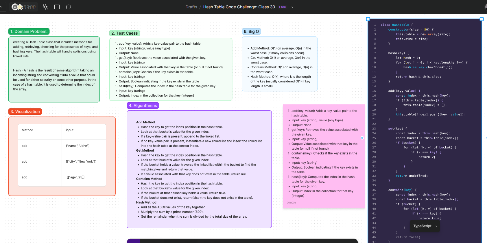

# challenge 30: Hash Table Implementation in JavaScript
Hash Function: A function that converts a key into a numerical index. This index determines where the key-value pair is stored in the hash table.

## Problem Domain

In this code challenge, we need to create a Hash Table class with the following methods:
- `add(key, value)`: Adds a key-value pair to the hash table.
- `get(key)`: Retrieves the value associated with the given key.
- `contains(key)`: Checks if the key exists in the table.
- `hash(key)`: Computes the index in the hash table for the given key.

## Whiteboard Process
[Figma](https://www.figma.com/board/2CfJ1XFhSXmEcBFe4kJo7S/Hash-Table-Code-Challenge%3A-Class-30?node-id=14905-11&t=pEyx9iu6r9PcCMfe-0) : 

## Approach:
- Create a hash table with a specified size.
- Implement a hash function to convert keys into indexes.
- Add method stores key-value pairs in the computed index.
- Get method retrieves values using the key.

### Big O Analysis
- Add Method: O(1) on average, O(n) in the worst case (if many collisions occur).
- Get Method: O(1) on average, O(n) in the worst case.
- Contains Method: O(1) on average, O(n) in the worst case.
- Hash Method: O(k), where k is the length of the key (usually considered O(1) if key length is small).

## Solution
[Code link](./hashtable.js)

## Credit
ChatGPT help implemented the test file.
