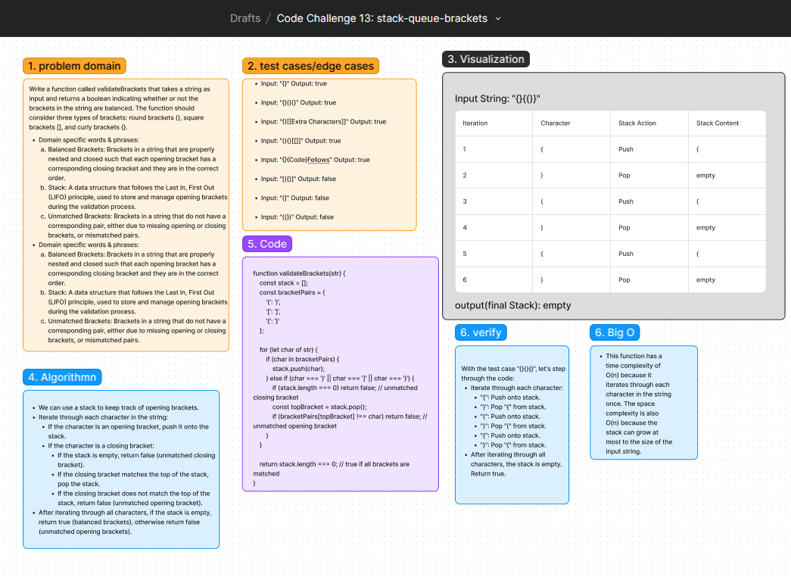

# Code Challenge: Class
Write a function called validateBrackets that takes a string as input and returns a boolean indicating whether or not the brackets in the string are balanced. The function should consider three types of brackets: round brackets (), square brackets [], and curly brackets {}.

## Whiteboard Process
[Figma](https://www.figma.com/board/hv55aPL26wghomVworbyqw/Code-Challenge-13%3A-stack-queue-brackets?node-id=10902-56&t=OReIC3lAjdna8RWr-0): 

## Approach
 We'll use a stack to keep track of opening brackets. We'll iterate through each character in the string. If we encounter an opening bracket, we'll push it onto the stack. If we encounter a closing bracket, we'll check if it matches the top of the stack (i.e., if it's the corresponding closing bracket). If it matches, we'll pop the opening bracket from the stack. If it doesn't match or the stack is empty, the brackets are not balanced.

### Big O
- This function has a time complexity of O(n) because it iterates through each character in the string once.
- The space complexity is also O(n) because the stack can grow at most to the size of the input string.

## Solution
[Code link](./validateBrackets.js)

## Credit
ChatGPT help implemented the test file
