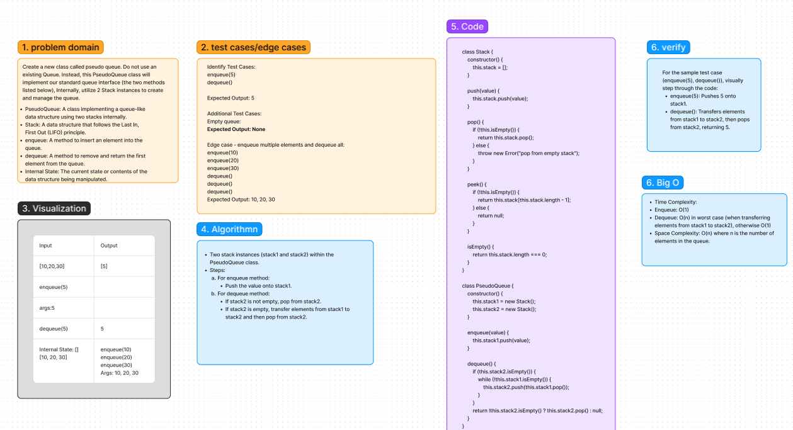

# Linked-List-kth Code Challenge: Class 07
Challenge Type: Code Challenge / Algorithm

## Whiteboard Process
[Figma](https://www.figma.com/file/jmvbc5xh4SekB9ZSI23vbg/Code-Challenge-11%3A-stack-queue-pseudo?type=whiteboard&node-id=0-1&t=7RN4HUlZADyw1uIr-0): 

## Approach
In this challenge, we implement a pseudo queue using two stacks. We maintain two stacks (stack1 and stack2). When enqueue operation is called, we push the element onto stack1. When dequeue operation is called, if stack2 is not empty, we pop from stack2, otherwise we pop all elements from stack1 and push them onto stack2, then pop from stack2. This ensures that the first element inserted in the queue is dequeued first.

### Big O
- Time Complexity:
Enqueue: O(1)
Dequeue: O(n) in worst case (when transferring elements from stack1 to stack2), otherwise O(1)
- Space Complexity: O(n) where n is the number of elements in the queue.

## Solution
[Code link](./pseudoQ.js)

## Credit
ChatGPT help implemented the test file

