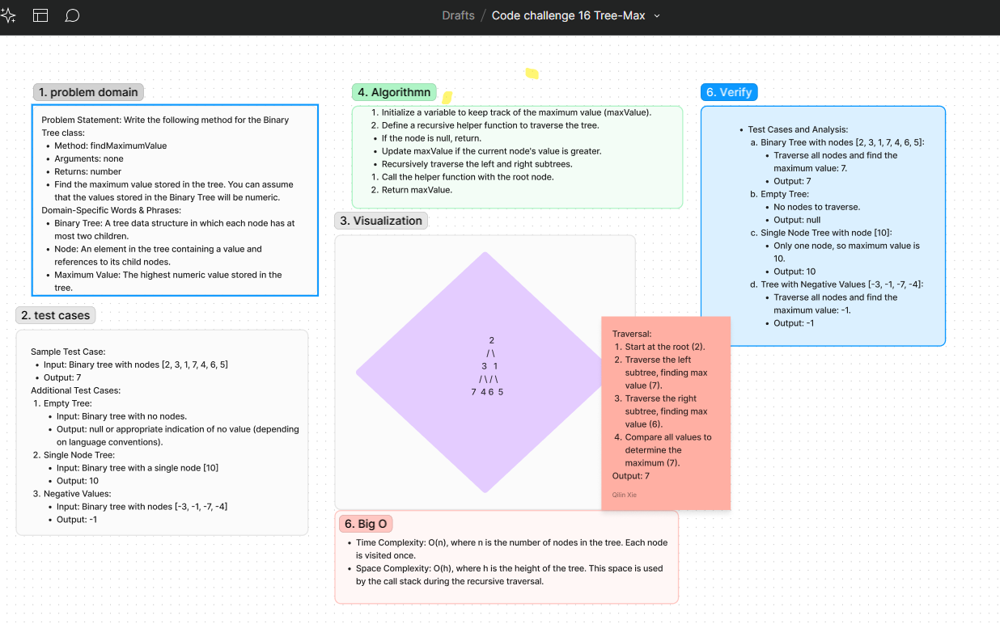

# Code Challenge: Class
Write the following method for the Binary Tree class
find maximum value
Arguments: none
Returns: number
Find the maximum value stored in the tree. You can assume that the values stored in the Binary Tree will be numeric.

## Whiteboard Process
[Figma](https://www.figma.com/board/8NOnQMwBSgB1RWWEFtx1Fh/Code-challenge-16-Tree-Max?node-id=0-1&t=WIzqWgjAtqtawlr1-0) :

## Approach
To find the maximum value in a binary tree, we will traverse the tree using a depth-first search (DFS) approach. During the traversal, we will keep track of the maximum value encountered. We'll use a recursive helper function to perform the traversal.

### Big O
- **Time Complexity**: O(n) - We visit each node exactly once where n is the number of nodes in the tree.
- **Space Complexity**: O(h) - The space complexity is proportional to the height of the tree due to the call stack in the recursive approach. In the worst case (skewed tree), this can be O(n). In the best case (balanced tree), this can be O(log n).

## Solution
[Code link](./maxTree.js)

## Credit
ChatGPT help implemented the test file
