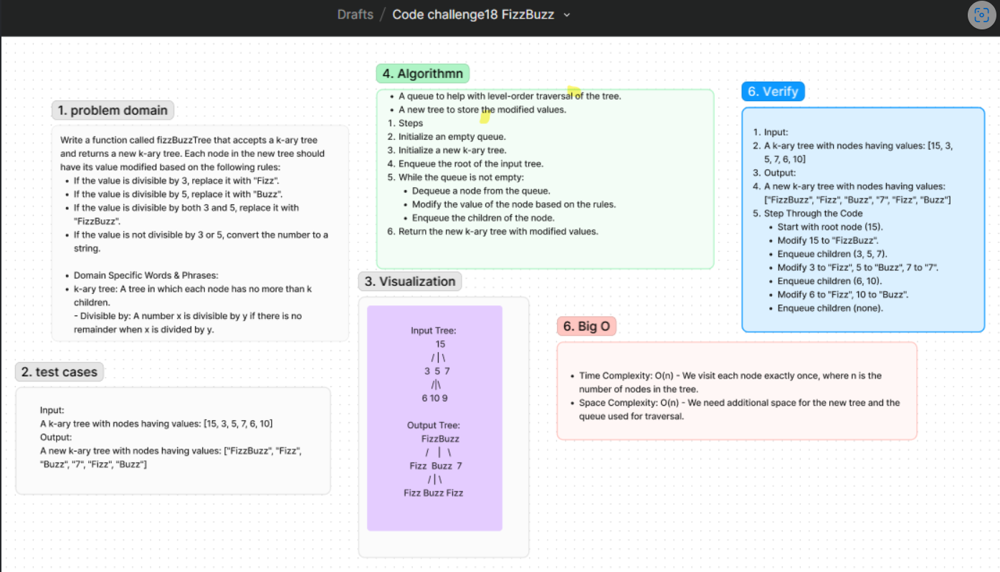

# Code Challenge: FizzBuzz K-ary Tree

Write a function called `fizzBuzzTree` that accepts a k-ary tree and returns a new k-ary tree. Each node in the new tree should have its value modified based on the following rules:
- If the value is divisible by 3, replace it with "Fizz".
- If the value is divisible by 5, replace it with "Buzz".
- If the value is divisible by both 3 and 5, replace it with "FizzBuzz".
- If the value is not divisible by 3 or 5, convert the number to a string.

## Whiteboard Process
[Figma](https://www.figma.com/board/P7Qx6EUx5SrTtmfrgueRPA/Code-challenge18-FizzBuzz?node-id=0-1&t=Oqek0VuqOIsDUQ89-0) :

## Approach
To implement `fizzBuzzTree`, we traverse the original k-ary tree and modify each node's value according to the specified rules. We then construct a new k-ary tree with the modified values while preserving the original tree's structure.

### Algorithm Steps
1. Traverse the original k-ary tree.
2. For each node:
   - If the value is divisible by both 3 and 5, set the value to "FizzBuzz".
   - If the value is divisible by 3, set the value to "Fizz".
   - If the value is divisible by 5, set the value to "Buzz".
   - If none of the above conditions are met, convert the number to a string.
3. Construct a new k-ary tree with the modified values.

### Big O
- **Time Complexity**: O(n) - We need to visit each node exactly once, where n is the number of nodes in the tree.
- **Space Complexity**: O(n) - In the worst case, the space required for the new tree is proportional to the number of nodes.

## Solution
[Code link](./FizzBuzz.js)

## Credit
ChatGPT help implemented the test file
