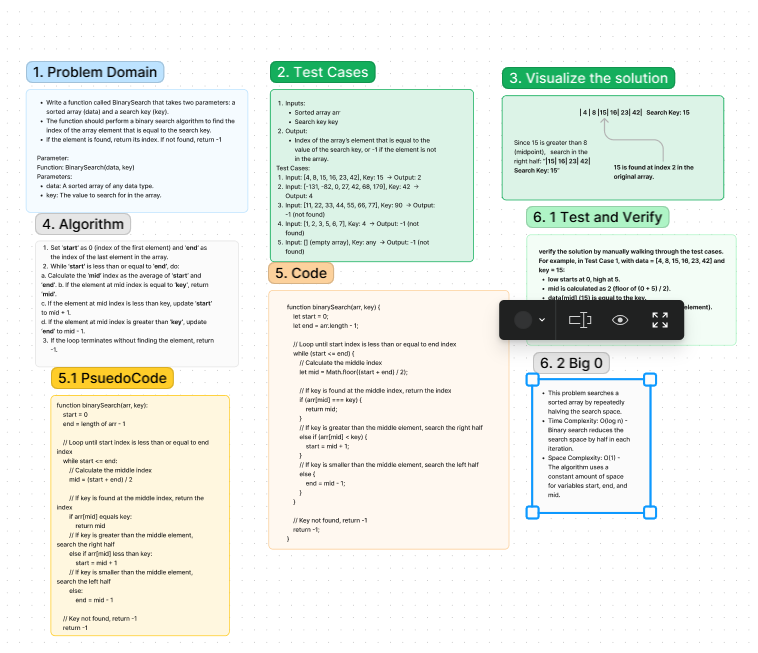

# Array-binary-search Code Challenge: Class 03
Write a function called BinarySearch that takes two parameters: a sorted array (data) and a search key (key).

## Whiteboard Process
array-insert-shift whiteboard created using Figma:

5/1/24, [online link](https://www.figma.com/file/A2xc6lhhYczl5EPTlE37xC/Code-challenge-3-array-binary-search?type=whiteboard&node-id=3-3613&t=SdmkxMoF7iHCGHXR-0)

## Approach & Efficiency
<!-- What approach did you take? Why? What is the Big O space/time for this approach? -->
This problem searches a sorted array by repeatedly halving the search space.

### Big O
Time Complexity: O(log n) - Binary search reduces the search space by half in each iteration.
Space Complexity: O(1) - The algorithm uses a constant amount of space for variables start, end, and mid.

## Solution
[Code link](./binary-search.js)

