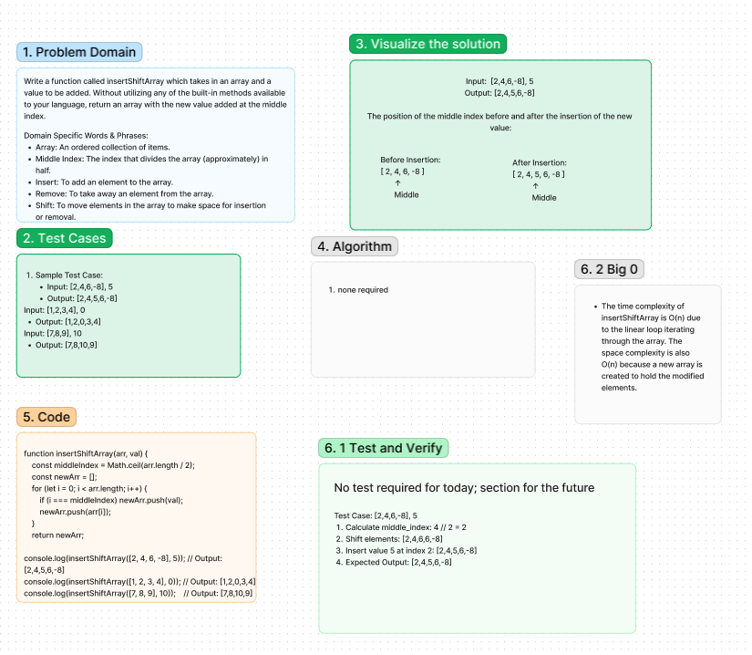

# Array-insert-shift Code Challenge: Class 02
The insertShiftArray function takes an array and a value as input and returns a new array with the given value inserted into the middle index of the original array.

## Whiteboard Process
array-insert-shift whiteboard created using Figma:

4/30/24, [online link](https://www.figma.com/file/gHVdJmalbYsX9OHkGzD52x/Code-challenge-2-Array-insert-shift-and-basic-server-UML?type=whiteboard&node-id=3-3595&t=3gwX7CSJktagqvNk-0)

## Approach & Efficiency
<!-- What approach did you take? Why? What is the Big O space/time for this approach? -->
1. Calculate the middle index of the original array by dividing its length by 2.
2. Create a new array to hold the modified elements.
Iterate through the original array using a loop.
3. If the current index is less than the middle index, copy the elements from the original array to the new array as-is.
4. If the current index is equal to the middle index, insert the given value into the new array.
5. If the current index is greater than the middle index, copy the elements from the original array to the new array shifted one position to the right.
Return the new array.

### Big O
Time Complexity: The time complexity of insertShiftArray is O(n) due to the linear loop iterating through the array.

Space Complexity: The space complexity is also O(n) because a new array is created to hold the modified elements.

## Solution
[Code link](./reverse-array.js)

