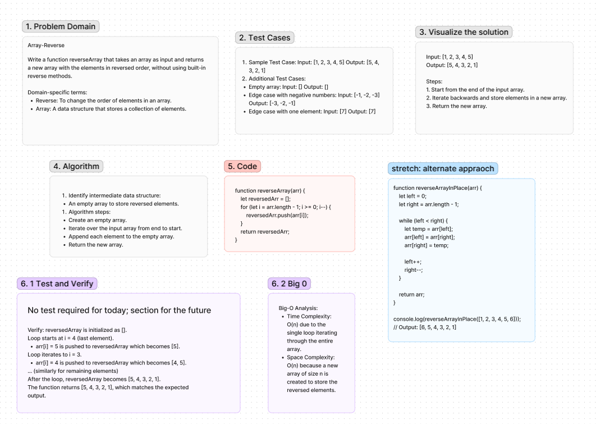

# Table of Contents 401 code challenges readme documentation:

## Array-reverse Code Challenge: Class 01
Write a function reverseArray that takes an array as input and returns a new array with the elements in reversed order, without using built-in reverse methods.

## Whiteboard Process
array-reverse whiteboard screenshot created using Figma:

4/29/24, [online link](https://www.figma.com/file/rWZyBtO1CRTwMWmfYBH7zS/Welcome-to-FigJam?type=whiteboard&node-id=0%3A1&t=UQNMrQ2l8zFORsgC-1)

## Approach & Efficiency
<!-- What approach did you take? Why? What is the Big O space/time for this approach? -->
class demo: We reversed the array by swapping the outside pair inward

## Solution
No code required but what it looks like: [Code link](./reverse-array.js)

