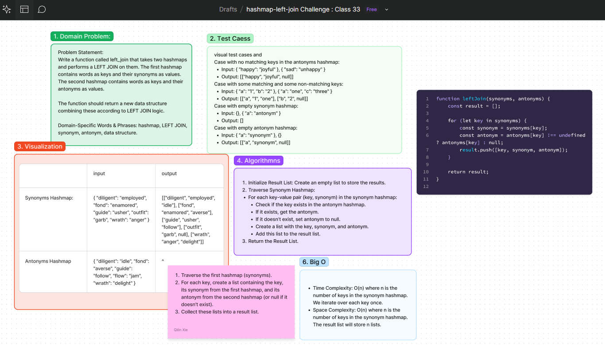

# Code Challenge: Left Join Two Hashmaps
Write a function called `left_join` that takes two hashmaps and performs a LEFT JOIN on them. The first hashmap contains words as keys and their synonyms as values. The second hashmap contains words as keys and their antonyms as values. The function should return a new data structure combining these according to LEFT JOIN logic.

## Whiteboard Process
[Figma](https://www.figma.com/board/rHieyYjLphz4UonwVPuDff/hashmap-left-join-Challenge-%3A-Class-33?node-id=0-1&t=g42yieZIxfe8bErY-0) : 


### Arguments
- **Input**: Two hashmaps:
  - The first hashmap has words as keys and their synonyms as values.
  - The second hashmap has words as keys and their antonyms as values.
- **Output**: A data structure that holds the combined results of the LEFT JOIN.

### Example
- **Input**:
  - Synonyms Hashmap:
    ```json
    {
      "diligent": "employed",
      "fond": "enamored",
      "guide": "usher",
      "outfit": "garb",
      "wrath": "anger"
    }
    ```
  - Antonyms Hashmap:
    ```json
    {
      "diligent": "idle",
      "fond": "averse",
      "guide": "follow",
      "flow": "jam",
      "wrath": "delight"
    }
    ```
- **Output**:
  ```json
  [
    ["diligent", "employed", "idle"],
    ["fond", "enamored", "averse"],
    ["guide", "usher", "follow"],
    ["outfit", "garb", null],
    ["wrath", "anger", "delight"]
  ]


### Approach
1. Traverse the first hashmap (synonyms) and for each key, look up its corresponding value in the second 2. hashmap (antonyms).
3. If the key exists in both hashmaps, combine the synonym and antonym into a list.
4. If the key exists only in the first hashmap, add the synonym and a null value for the antonym.
Collect these lists into a result list.

### Big O Analysis
- Time Complexity: O(n) where n is the number of keys in the synonym hashmap. We iterate over each key once.
- Space Complexity: O(n) where n is the number of keys in the synonym hashmap. The result list will store n lists.

## Solution
[Code link](./leftjoin.js)

## Credit
ChatGPT help implemented the test file.
