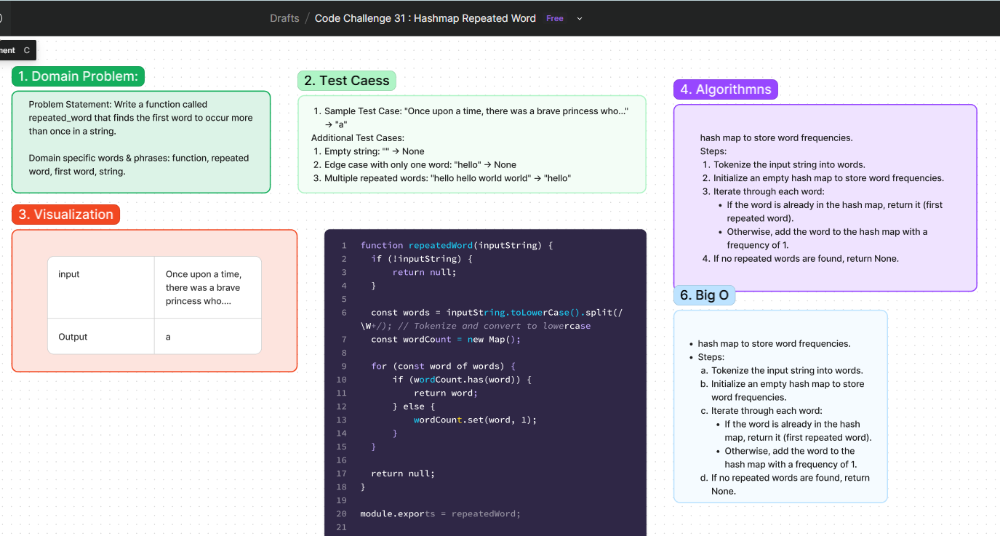

# Code Challenge 31 : Hashmap Repeated Word
Write a function called `repeatedWord` that finds the first word to occur more than once in a string.

### Arguments
- `string`: The input string to search for repeated words.

### Return
- `string`: The first word that occurs more than once.

## Whiteboard Process
[Figma](https://www.figma.com/board/YTEumVJHO3pYKG7QrXeQEm/Hash-Table-Code-Challenge%3A-Class-30-(Copy)?node-id=14907-13&t=UYucS8vwcpMVTxi7-0) : 

## Approach
To implement `repeatedWord`, we will:
1. Tokenize the input string into words.
2. Convert all words to lowercase to ensure case insensitivity.
3. Use a hash map to track the frequency of each word.
4. Return the first word that appears more than once.

### Algorithm Steps
1. Tokenize the input string into words.
2. Initialize an empty hash map to store word frequencies.
3. Iterate through each word:
   - If the word is already in the hash map, return it as the first repeated word.
   - Otherwise, add the word to the hash map with a frequency of 1.
4. If no repeated words are found, return `None`.

### Big O
- **Time Complexity**: O(n) - We need to visit each word exactly once, where n is the number of words in the input string.
- **Space Complexity**: O(n) - In the worst case, the space required for the hash map is proportional to the number of unique words.

## Solution file
[Solution](map.js)

## Credit
ChatGPT helped implement the test file.
