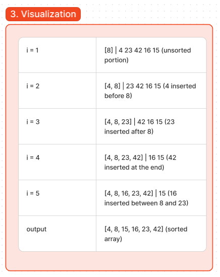

# Code Challenge: Class 26 - Insertion Sort
This document delves into Insertion Sort, a fundamental sorting algorithm. We'll revisit Big O notation, then dissect the provided pseudocode and visually trace its execution on a sample array. Finally, we'll translate the pseudocode into working JavaScript code with unit tests.

## Big O Refresher

Big O notation describes an algorithm's efficiency as its input size grows. In Insertion Sort's case, we'll focus on time complexity, which measures the number of operations it performs relative to the input size.

## Understanding the Pseudocode
```
Insert(int[] sorted, int value)
  initialize i to 0
  WHILE value > sorted[i]
    set i to i + 1
  WHILE i < sorted.length
    set temp to sorted[i]
    set sorted[i] to value
    set value to temp
    set i to i + 1
  append value to sorted

InsertionSort(int[] input)
  LET sorted = New Empty Array
  sorted[0] = input[0]
  FOR i from 1 up to input.length
    Insert(sorted, input[i])
  return sorted
```
[Figma](https://www.figma.com/board/dhjfiXaX40nYuJ9gzbySyA/Sorting-Insertion-Code-Challenge%3A-Class-26?node-id=0-1&t=WWfyCEG5rzYHbLlp-0)

## Sample Array Breakdown : 

Let's use the sample array `[8, 4, 23, 42, 16, 15]` to visualize Insertion Sort:

### Iteration 1 (Inserting 4):

- **Sorted:** [8]
- **Processing:** 4 (compared to 8)
- **New Sorted:** [4, 8] (4 inserted before 8)

### Iteration 2 (Inserting 23):

- **Sorted:** [4, 8]
- **Processing:** 23 (compared to 4 and 8)
- **New Sorted:** [4, 8, 23] (23 inserted after 8)

### Iteration 3 (Inserting 42):

- **Sorted:** [4, 8, 23]
- **Processing:** 42 (compared to 4, 8, and 23)
- **New Sorted:** [4, 8, 23, 42] (42 inserted at the end)

### Iteration 4 (Inserting 16):

- **Sorted:** [4, 8, 23, 42]
- **Processing:** 16 (compared to 4, 8, and 23)
- **New Sorted:** [4, 8, 16, 23, 42] (16 inserted between 8 and 23)

### Iteration 5 (Inserting 15):

- **Sorted:** [4, 8, 16, 23, 42]
- **Processing:** 15 (compared to 4, 8, and 16)
- **New Sorted:** [4, 8, 15, 16, 23, 42] (15 inserted between 8 and 16)

### Final Sorted Array:

- **Array:** [4, 8, 15, 16, 23, 42]


## Approach

We will use the Insertion Sort algorithm, which builds the final sorted array one item at a time. The algorithm iterates over the input array and, for each element, inserts it into its correct position within a sorted portion of the array. This involves shifting elements in the sorted portion to make space for the new element.

### Detailed Steps:
1. Initialize the `sorted` array with the first element of the input array.
2. Iterate through the remaining elements of the input array.
3. For each element, use the `insert` function to place it in the correct position in the `sorted` array by:
   - Comparing the current element with elements in the `sorted` array.
   - Shifting elements in the `sorted` array as needed to make space for the current element.
4. Append the current element to its correct position.
5. Repeat the process until all elements are sorted.

### Big O

- **Time Complexity**: O(n^2) in the worst case, where `n` is the number of elements in the input array. This occurs when the input array is in reverse order.
- **Space Complexity**: O(n) for the additional list used to build the sorted array.


## Solution
[Code link](./sorting.js)

## Credit
Bard help implemented the test file
