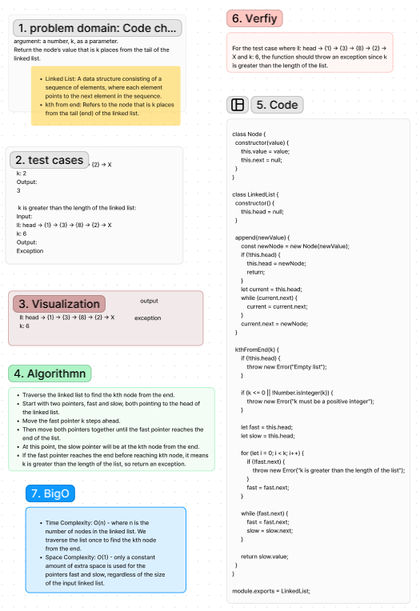

# Linked-List-kth Code Challenge: Class 07
Implement a method for the Linked List class that returns the value of the node that is k places from the tail of the linked list.

Challenge Type: Extending an Implementation

Write the following method for the Linked List class:
kth from end argument: a number, k, as a parameter.
Return the node’s value that is k places from the tail of the linked list.
You have access to the Node class and all the properties on the Linked List class as well as the methods created in previous challenges.

## Whiteboard Process
[Figma](https://www.figma.com/file/4iHdkwrl6FJce5uxguG4iV/Code-challenge-7%3A-linked-list-kth?type=whiteboard&node-id=0-1&t=G45xS2XxBVDRSjLO-0):

## Approach & Efficiency
I traverse the linked list using two pointers: fast and slow. The fast pointer is moved k steps ahead initially, and then both pointers are moved together until the fast pointer reaches the end of the list. It find the kth node from the end efficiently without needing additional data structures.

### Big O
Time Complexity: O(n) - where n is the number of nodes in the linked list. We traverse the list once to find the kth node from the end.
Space Complexity: O(1) - only a constant amount of extra space is used for the pointers fast and slow, regardless of the size of the input linked list.

## Solution
[Code link](./kth.test.js)

## Credit
ChatGPT help implemented the test file

