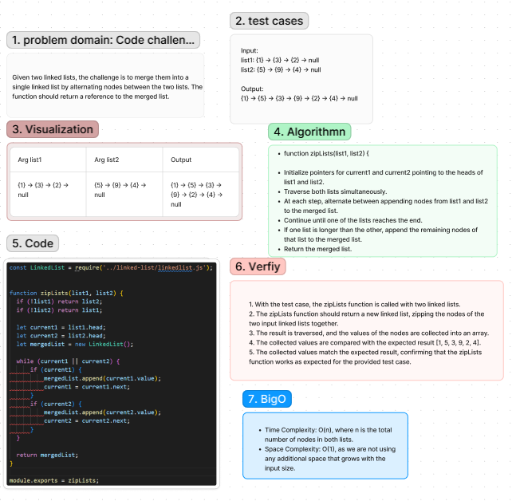

# Linked-List-zip Code Challenge: Class 08
Given two linked lists, the challenge is to merge them into a single linked list by alternating nodes between the two lists. The function should return a reference to the merged list.

Challenge Type: Extending an Implementation

## Whiteboard Process
[Figma](https://www.figma.com/file/bTaw6q9YfR4suxnQevwqNw/Code-challenge-8%3A-linked-list-zip?type=whiteboard&node-id=0-1&t=gnvj0rr8dEIttGp4-0):

## Approach
1. With the test case, the zipLists function is called with two linked lists.
2. The zipLists function should return a new linked list, zipping the nodes of the two input linked lists together.
3. The result is traversed, and the values of the nodes are collected into an array.
4. The collected values are compared with the expected result [1, 5, 3, 9, 2, 4].
5. The collected values match the expected result, confirming that the zipLists function works as expected for the provided test case.

### Big O
The time complexity of the zipLists function is O(n), where n is the number of nodes in the longer of the two input linked lists. This is because we traverse both linked lists once to zip them together.

The space complexity of the zipLists function is O(1), as we only use a constant amount of additional space regardless of the size of the input linked lists.

## Solution
[Code link](./zip.test.js)

## Credit
ChatGPT help implemented the test file

