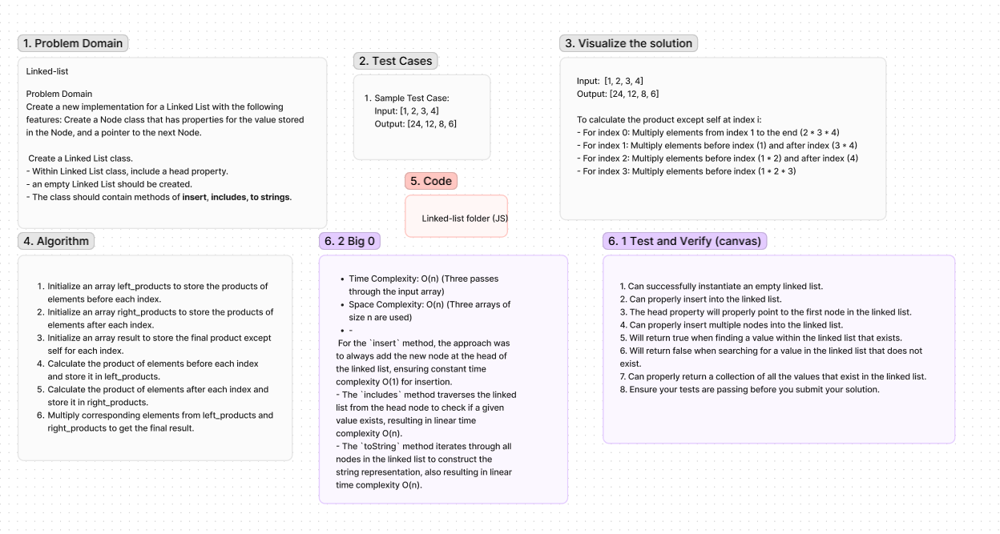

# Linked-List Code Challenge: Class 05
Implementing a function that takes an array of integers and returns an array of the same size where each element is the product of all the elements in the input array except the element at that index.

## Whiteboard Process
whiteboard created using Figma:
5/3/24, [online link](https://www.figma.com/file/8jmY9sSliM7MCQ2Bj1rzE5/Code-challenge-5%3A-Linked-list?type=whiteboard&node-id=0-1&t=rkxy3Ex2cZbDJZCa-0)

## Approach & BIG O

<!-- What approach did you take? Why? What is the Big O space/time for this approach? -->
- For the `insert` method, the approach was to always add the new node at the head of the linked list, ensuring constant time complexity O(1) for insertion.
- The `includes` method traverses the linked list from the head node to check if a given value exists, resulting in linear time complexity O(n).
- The `toString` method iterates through all nodes in the linked list to construct the string representation, also resulting in linear time complexity O(n).

## Solution

- [Code link](./linkedlist.js)
- [Test link](linked-list.test.js)

