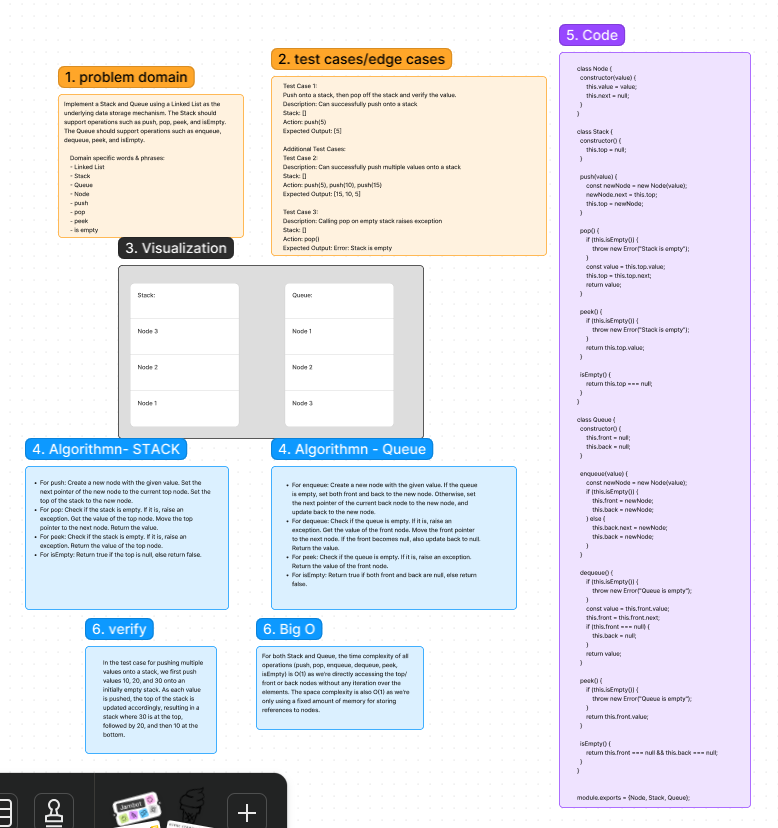
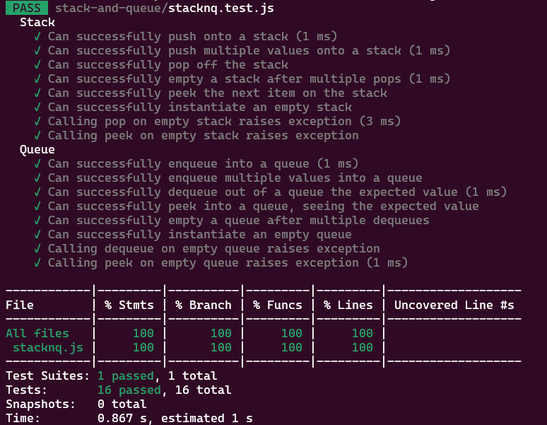

# Stack-and-queue Code Challenge: Class 11
Implement a Stack and Queue using a Linked List as the underlying data storage mechanism. The Stack should support operations such as push, pop, peek, and isEmpty. The Queue should support operations such as enqueue, dequeue, peek, and isEmpty.

## Whiteboard Process
[Figma](https://www.figma.com/file/Y3rEz9qXbC7ukVAlhhFT21/Code-Challenge-10%3A-stack-and-queue?type=whiteboard&node-id=10902-61&t=WGFx4MGrK0ekghWh-0): 

## Approach & Big O Efficiency
For both Stack and Queue, the time complexity of all operations (push, pop, enqueue, dequeue, peek, isEmpty) is O(1) as we're directly accessing the top/front or back nodes without any iteration over the elements. The space complexity is also O(1) as we're only using a fixed amount of memory for storing references to nodes.

## Solution
[Code link](./stacknq.js)

## Credit
ChatGPT help implemented the test file

