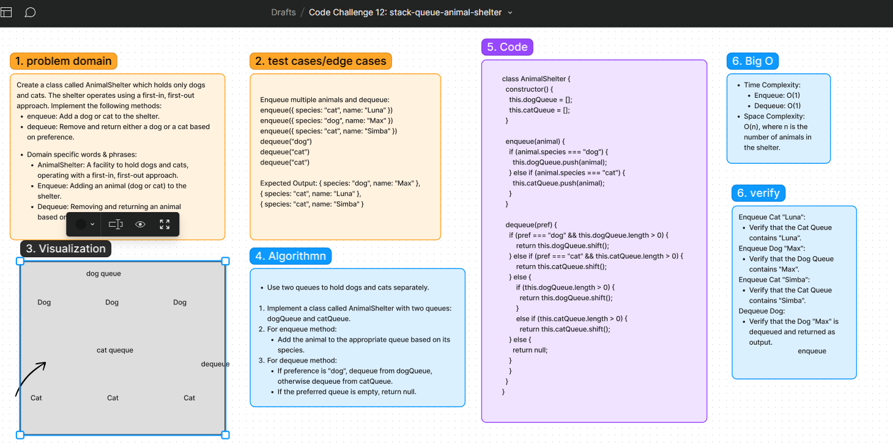

# stack-queue-animal-shelter Code Challenge: Class 12
Problem Statement:
Create a class called AnimalShelter which holds only dogs and cats. The shelter operates using a first-in, first-out approach.

## Whiteboard Process
[Figma](https://www.figma.com/board/xU5peXTU9oKKberpSxI45e/Code-Challenge-12%3A-stack-queue-animal-shelter?node-id=10902-56&t=y18J5keeiMaOB4HT-0): 

## Approach
-  enqueue Method:
When an animal is enqueued, we will determine its species (dog or cat).
Based on the species, we will enqueue the animal into the respective queue.
- dequeue Method:
When an animal is dequeued, we will check the preference specified (dog or cat).
If the preference matches the available animals in the corresponding queue, we will dequeue and return the first animal of that species.
If the preferred species queue is empty, we will check the other species queue.
If both queues are empty or the preference is neither dog nor cat, we will return null.

### Big O
- Time Complexity:
Enqueue: O(1)
Dequeue: O(1)
- Space Complexity: O(n), where n is the number of animals in the shelter.

## Solution
[Code link](./animalShelter.js)

## Credit
ChatGPT help implemented the test file
