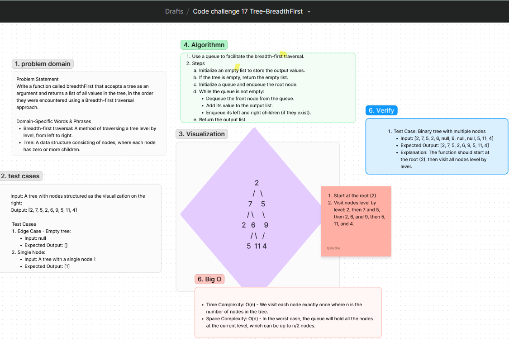

# Code Challenge: Tree Breadth-First Traversal

Write a function called `breadthFirst` that accepts a tree as an argument and returns a list of all values in the tree, in the order they were encountered using a Breadth-first traversal approach.

## Whiteboard Process
[Figma](https://www.figma.com/board/NsbywuE7pej6emU9EPB4Os/Code-challenge-17-Tree-Max?node-id=0-1&t=uxC4iT7n0lBtTTfn-0) : 

## Approach
To perform a breadth-first traversal, we will use a queue to keep track of the nodes at each level of the tree. Starting from the root, we will enqueue nodes level by level, adding their values to the result list as we process them.

### Algorithm Steps
1. Initialize an empty list to store the output values.
2. If the tree is empty, return the empty list.
3. Initialize a queue and enqueue the root node.
4. While the queue is not empty:
   - Dequeue the front node from the queue.
   - Add its value to the output list.
   - Enqueue its left and right children (if they exist).
5. Return the output list.

### Big O
- **Time Complexity**: O(n) - We visit each node exactly once where n is the number of nodes in the tree.
- **Space Complexity**: O(n) - In the worst case, the queue will hold all the nodes at the current level, which can be up to n/2 nodes.

## Solution
[Code link](./breadthFirst.js)
