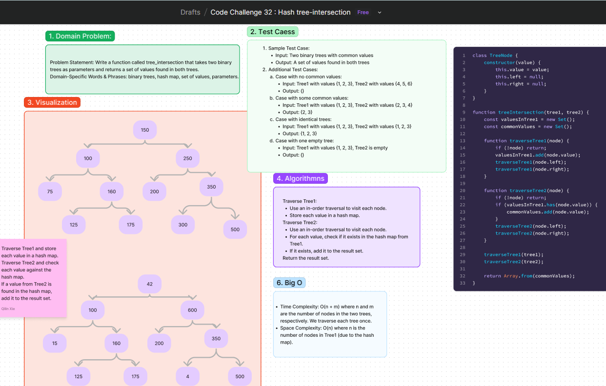

# Code Challenge: Tree Intersection
Write a function called `tree_intersection` that takes two binary trees as parameters and returns a set of values found in both trees.

## Whiteboard Process
[Figma](https://www.figma.com/board/BEnfBNuFpaEI9QOPaKvgO0/Code-Challenge-32-%3A-Hash-tree-intersection?node-id=14905-5&t=UYucS8vwcpMVTxi7-0) : 

### Arguments
- **Input**: Two binary trees
- **Output**: A set of values found in both trees

## Approach
To implement `tree_intersection`, we will:
1. Traverse the first binary tree and store each value in a hash map.
2. Traverse the second binary tree and check each value against the hash map.
3. Collect values that are found in both trees into a set.

### Algorithm Steps
1. **Traverse Tree1**:
   - Use an in-order traversal to visit each node.
   - Store each value in a hash map.
2. **Traverse Tree2**:
   - Use an in-order traversal to visit each node.
   - For each value, check if it exists in the hash map from Tree1.
   - If it exists, add it to the result set.
3. **Return the result set**.

### Big O
- **Time Complexity**: O(n + m) - We need to traverse each tree once, where n and m are the number of nodes in the two trees respectively.
- **Space Complexity**: O(n) - The space required for the hash map is proportional to the number of nodes in Tree1.

## Solution
[Code link](./tree-intersection.js)

## Credit
ChatGPT help implemented the test file
